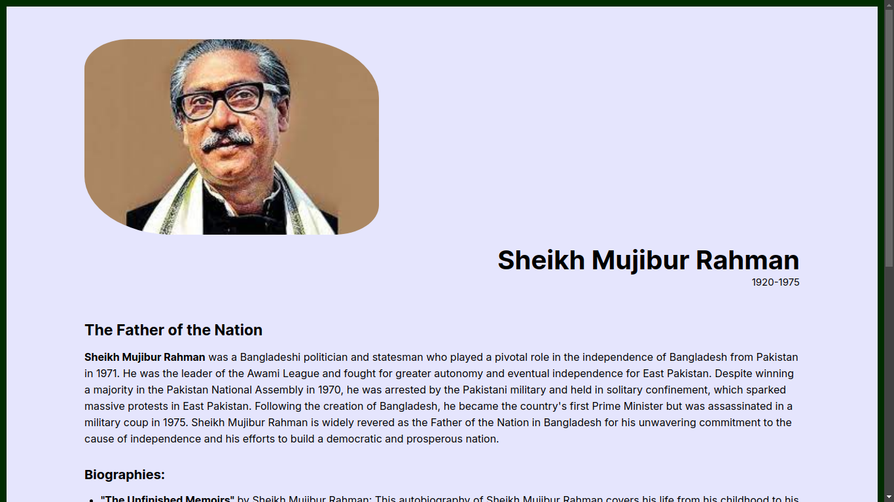

# The Tribute Page

I recently created a [tribute page](https://mdkawserishtiak.github.io/the-tribute-page/) for **Sheikh Mujibur Rahman** using **HTML** and **CSS**, and I'm thrilled with how it turned out.
As someone who's deeply inspired by Sheikh Mujibur Rahman's leadership and vision for a democratic Bangladesh, it was a
privilege to pay homage to him through this project.

To begin with, I researched Sheikh Mujibur Rahman's life and career to create a brief biography that highlighted his
contributions to the Bangladesh independence movement and his efforts to build a better Bangladesh.

The design of the tribute page features a simple yet elegant layout, with a stylish image of Sheikh Mujibur Rahman at the
top of the page. I divided the page into sections, with each section focusing on a different aspect of his life and
career. I used the colors of the Bangladesh flag, green and red, to create a cohesive color scheme throughout the page.

Using CSS, I made sure that the tribute page was **responsive** and accessible on a range of devices, from desktops to
mobile devices. I also incorporated modern design elements such as **hover effect** to make the page more
engaging and interactive.

Overall, I'm proud of the tribute page I created for Sheikh Mujibur Rahman. It's a fitting tribute to a great leader who
played a pivotal role in shaping the history of Bangladesh, and I hope that it helps others to learn more about his
legacy and contributions.

To learn more about [Sheikh Mujibur Rahman.](https://en.wikipedia.org/wiki/Sheikh_Mujibur_Rahman)
